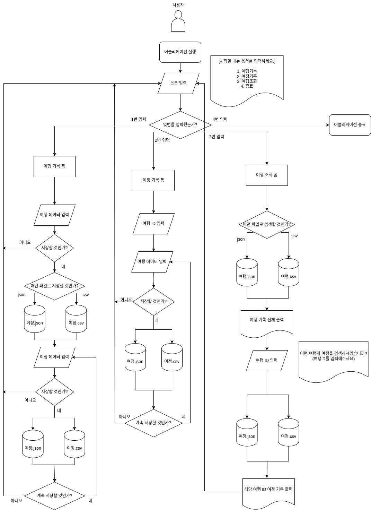

# [4조] 토이 프로젝트1 : 여행 여정을 기록과 관리하는 SNS 서비스 1단계

## 🧑‍🤝‍🧑 조원 & 역할

| 이름  | 역할                   |
|-----|----------------------|
| 한상우 | 조장, 여정 도메인 개발, 노션 관리 |
| 구자현 | 설계, 뷰 도메인 개발, git 관리 |
| 박경탁 | 여행 도메인 개발            |
| 심재철 | 여행 도메인 개발            |
| 이민균 | 여정 도메인 개발            |

## 🚀 프로젝트 일정

- 프로젝트 기간: 9월 4일(월) ~ 9월 8일(금)


## 🧾 프로젝트 설명

- 여행 및 여정 정보를 콘솔로 입력받아 기록하고 조회할 수 있는 Java 어플리케이션입니다.
- 여행 및 여정 정보는 파일 시스템에 JSON과 CSV로 저장됩니다.
- **3-Layered(컨트롤러-서비스-DAO) MVC 패턴**으로 설계했습니다.
- JSON과 CSV 관련 오픈소스 라이브러리를 사용하여 개발했습니다.
- 여행, 여정, 뷰에 대한 테스트 코드를 작성했습니다.

## 🛠️ 개발 환경

- 빌드 관리 도구 : gradle
- 자바 버전: **17**
- 의존성
  - gson
  - opencsv
  - lombok
- 테스트 의존성
  - junit 5 (jupiter)
  - javafaker

## 📐 설계도


## 📦 패키지 구조

```tree
Main
├── Trip (여행)
│   └── controller (뷰에 전달할 컨트롤러 객체)
│       └── dto (뷰용 데이터 전달 객체)
│   ├── dao (파일 create, update, read API)
│   ├── dto (서비스용 데이터 전달 객체)
│   ├── domain (데이터 객체)
│   ├── service (뷰에 전달할 인터페이스)
│   └── util (CSV 변환에 사용하는 유틸 객체)
├── Itinerary (여정)
│   └── controller (뷰에 전달할 컨트롤러 객체)
│       └── dto (뷰용 데이터 전달 객체)
│   ├── dao (파일 create, update, read API)
│   ├── dto (서비스용 데이터 전달 객체)
│   ├── entity (데이터 객체)
│   ├── exception (예외처리용 객체)
│   ├── type (파일 타입 구분 enum)
│   └── service (뷰에 전달할 인터페이스)
└── controller (뷰)
    └── console (콘솔 뷰 객체)

resources (데이터 파일 저장 경로)
├── Trip
│   ├── json
|   │   └── trip_1.json
│   └── csv
|       └──csv_1.csv
└── Itinerary
    ├── json
    │   └── itineraries_trip_1.json
    └── csv
        └── itineraries_trip_1.csv
```

## 🤝 브랜치 전략

💡 git flow의 일부만 사용했습니다.
- `main` branch
- 기능 추가 시 `feature/기능명` branch 사용
  - 기능들은 `main` branch에 풀 리퀘스트 후 합병
- 버그 수정 시 `bugfix/버그명` branch 사용
  - 수정 후 `main` branch에 풀 리퀘스트 후 합병 


## ⚙ 기능 

|   기능    |                             설명                             |
| :-------: | :----------------------------------------------------------: |
| 여행 기록 | 사용자가 여행 데이터를 입력하면, 여행 입력 데이터를 CSV나 JSON 중 하나를 골라 해당 파일의 형태로 저장한다. <br>이후, 여정 데이터를 입력하면  앞서 저장했던 여행 기록에 속한 여정 데이터를 CSV와 JSON 파일의 형태로 저장한다. |
| 여정 기록 | 사용자가 여행 ID를 입력하면, 여행 ID와 관련된 여행 기록에 대해 여정 데이터를 추가 저장할 수 있다. (CSV와 JSON파일의 형태로) |
| 여행 조회 | 모든 여행 기록을 조회한다. <br> 사용자가 여행 ID를 입력하면, 그 여행 ID와 관련된 여정 기록을 볼 수 있다. |
|   종료    |                   애플리케이션을 종료한다.                   |


## 📈 플로우 차트

⚡ 사용자 입장에서의 플로우 차트입니다.



